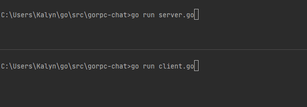

# gorpc-chat
This is a simple Go program that utilizes `Protoc` and `gRPC` to create a server and client that communicate to each other.
## Demo

## How It Works
### Using a Proto file to build a gRPC service
By using `Protoc`, it is possible to generate a `gRPC` service file by starting with a `.proto` file. Here's an example service in `chat.proto`:
```proto
service ChatService {
    rpc SayHello(Message) returns (Message) {}
}
```
Then you may generate the service file, e.g. `chat.pg.go` using this command:
```powershell
protoc --go_out=plugins=grpc:chat chat.proto
```
### Creating a Go server
By using Google's grpc package, `google.golang.org/grpc` you can create a listener (w/o error handling for brevity):
```go
lis, err := net.Listen("tcp", ":9000")
```
Since the chat service was generated, it can be imported locally and used to instantiate and connect the service to a `gRPC` server:
```go
s := chat.Server{}  // Instantiate chat server
grpcServer := grpc.NewServer() // Instantiate gRPC server
chat.RegisterChatServiceServer(grpcServer, &s) // Register the chat service to the gRPC server
err := grpcServer.Serve(lis) // Start the grpcServer
```
### Creating a Go function for gRPC to use
When we generated the service file using `chat.proto`, we specified a `service ChatService` with a `rpc SayHello(Message)` function. Let's implement that in `chat.go`:
```go
type Server struct {} // Empty Server struct for gRPC

// SayHello receives a message from client, then returns a message to it.
func (s *Server) SayHello(ctx context.Context, message *Message) (*Message, error) {
	log.Printf("Received message body from client: %s", message.Body)
	return &Message{Body: "Hello from the server!"}, nil
}
```
### Creating a Go client
Now we need a client to `SayHello()` to the server. We can create a `gRPC` connection:
```go
var conn *grpc.ClientConn
conn, err := grpc.Dial(":9000", grpc.WithInsecure())
defer conn.Close()
```
Next, let's instantiate the chat service on the connection and send a message:
```go
c := chat.NewChatServiceClient(conn) // Connect chat service
message := chat.Message { // Create Message with body
  Body: "Hello from the client!",
}
response, err := c.SayHello(context.Background(), &message) // Send a message
```
Finally, everything is in place for our Go programs to communicate with eachother via `gRPC`.
### Run the server and client
Start the server:
```powershell
go run server.go
```
Example output:
```
2020/11/06 23:12:15 Starting gRPC server on TCP Port :9000
2020/11/06 23:12:17 Received message body from client: Hello from the client!
```
Start the client:
```powershell
go run client.go
```
Example output:
```
2020/11/06 23:12:17 Response from server: Hello from the server!
```
